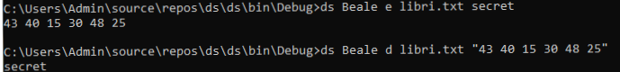
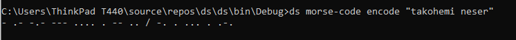

# DS_2020_Gr26
Cryptography is a method of protecting information and communications through the use of codes so that only those for whom the information is intended can read and process it.The pre-fix "crypt" means "hidden" or "vault" and the suffix "graphy" stands for "writing." Cryptography is most often associated with scrambling plaintext (ordinary text, sometimes referred to as cleartext) into ciphertext (a process called encryption), then back again (known as decryption).

Morse code is a method of transmitting text information as a series of on-off tones, lights, or clicks that can be directly understood by a skilled listener or observer without special equipment. It is named for Samuel F. B. Morse, an inventor of the telegraph.
The algorithm is very simple.Every character is substituted by a series of ‘dots’ and ‘dashes’ or sometimes just singular ‘dot’ or ‘dash’ and vice versa.
Every text string is converted into the series of dots and dashes. For this every character is converted into its Morse code and appended in encoded message.
Encode a message by replacing each letter by its code symbol. Then decode the message using Morse code. Make sure you use a delimiter symbol between coded letters.
# Morse-Code
Dictionary

# 1.Komanda Beale
Beale cipher është një algoritëm qe e shfrytëzon një tekst dokument si libër.Me këtë metodë zëvendësohet cdo shkronjë në mesazhin
sekret me indeksin e një  fjale në libër që fillon me atë shkronjë.Gjithashtu duhet pasur kujdes që per shkaqe sigurie mos të enkriptohet shkronja e njejtë me të njëjtin numer.Ndërsa nëse duam ta dekpritojm mesazhin  sekret atëherë  numri në atë mesazh paraqet indeksin e një fjale në  libër dhe marrim shkronjën e parë të saj.
Shkrimi i argumenteve në mënyrë adekuate bëhet siq është paraqitur më poshtë pra ashtu si sintaksa në kërkesën e projektit.

# 2.Komanda Morse Code
Komanda Morse është një kod që përdoret për të koduar mesazhe që përbëhen nga shkronja dhe shifra. Cdo shkronje përbëhet nga një seri . dhe _. 
Ruajtja e shkronjave dhe vlerave perkatese te tyre ne Morse Code eshte bere duke krijuar objektin MorseDictionary ne kaudaer te klases Dictionary. Per secilin funksion eshte dhene pershikrimi si koment ne kuader te programit.
Shkrimi i argumenteve ne menyre adekuate behet siq eshte paraqitur me poshte pra ashtu si sintaksa ne kerkesen e projektit.

Kerkesen shtese audio e kemi bere te ekzekutohet ne momentin kur si argument eshte "audio" dhe teksti hyres eshte ne Morse Code atehere ndegjohet ajo vlere hyrese si nga makina Morse.
# 3.Komanda Playfair
Matrica qelës formohet duke u bazuar në një keyëord.Nëse një shkronjë përsëritet më shumë se 1 herë ajo shënohet vetëm herën e parë.Mesazhi sekret duhet të ndahet në grupacion nga dy shkronja.Nëse mesazhi sekret nuk ka nr cift të shkronjave duhet të vendosim 'x'.Rregullat për enkriptim:
1.Nëse shkronjat jane në rreshta të njëjtë atëherë duhet të merret elementi pasues
# --> Referencat : 
 https://www.geeksforgeeks.org , 
 https://docs.microsoft.com/en-us/dotnet/api/system.collections.generic.dictionary-2?view=netframework-4.7 , 
 https://searchsecurity.techtarget.com/definition/cryptography.
                      
