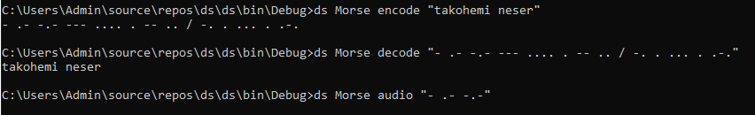

# DS_2020_Gr26
Zhvillimi i projektit gjendet në folderin ds përkatësisht në klasen ds.cs në të cilen permes objekteve i kemi thirrur klasat që në vete përmbajnë funksionet për Komanden Beale(beale-cipher.cs) për Komanden Morse Code (morse-code.cs) për Komanden Playfair(playfair-cipher.cs) për Komanden Create-user(create-user.cs) për Komanden Delete-user(delete-user.cs) për Komanden export-key(export-key) për Komanden import-key(import-key) për Komanden write-message dhe për Kamanden read-message(read_write.cs).Programi është zhvilluar ne gjuhen programuese C# dhe implementohet ne Console.

# Komanda Beale
Beale cipher është një algoritëm qe e shfrytëzon një tekst dokument si libër.Me këtë metodë zëvendësohet cdo shkronjë në mesazhin
sekret me indeksin e një  fjale në libër që fillon me atë shkronjë.Gjithashtu duhet pasur kujdes që per shkaqe sigurie mos të enkriptohet shkronja e njejtë me të njëjtin numer.Ndërsa nëse duam ta dekpritojm mesazhin  sekret atëherë  numri në atë mesazh paraqet indeksin e një fjale në  libër dhe marrim shkronjën e parë të saj.
Shkrimi i argumenteve në mënyrë adekuate bëhet siq është paraqitur më poshtë pra ashtu si sintaksa në kërkesën e projektit.

# Komanda Morse Code
Komanda Morse është një kod që përdoret për të koduar mesazhe që përbëhen nga shkronja dhe shifra. Cdo shkronjë në alfabetin Latin si dhe shifrat janë ekuivalent me një seri . dhe -. në Morse Code. 
Ruajtja e shkronjave&shifrave dhe vlerave përkatese të tyre në Morse Code është bërë duke krijuar objektin MorseDictionary në kuader te klasës Dictionary si dhe për secilin funksion është dhëne përshkrimi si koment në program.
Kërkesa shtesë --audio është bërë në atë menyrë që të ekzekutohet në momentin kur si argument është "audio" dhe teksti hyrës është në Morse Code atëherë ndëgjohet ajo vlerë hyrëse si nga makina Morse.
Shkrimi i argumenteve në mënyrë adekuate bëhet siq është paraqitur më poshtë pra ashtu si sintaksa në kërkesën e projektit.

# Komanda Playfair
Komanda Playfair bazohet në matricën 5x5.Në atë matricë e vendosim alfabetin mirëpo pasi alfabeti i ka 26 shkronja, i dhe j e marrin të njëjtën qeli.Matrica qelës formohet duke u bazuar në një keyword.Nëse një shkronjë përsëritet më shumë se 1 herë ajo shënohet vetëm herën e parë.Mesazhi sekret duhet të ndahet në grupacion nga dy shkronja.Nëse mesazhi sekret nuk ka nr cift të shkronjave duhet të vendosim 'x'.Rregullat për enkriptim:
1.Nëse shkronjat jane në rreshta të njëjtë atëherë duhet të merret elementi pasues
2.Nëse ato jane në kolona të njëjta atëherë merret el. i rreshtit pasues por i kolonës të njëjtë.
3.Nëse ato nuk janë as në kolona e as në rreshta të njejtë atëherë merret el. i rreshtit të njëjtë por ne kolonën e karakterit tjetër.
Shkrimi i argumenteve në mënyrë adekuate bëhet siq është paraqitur më poshtë pra ashtu si sintaksa në kërkesën e projektit.

Gjenerimi i tabeles ne baze te keyword per piket shtese

# Komanda Create-user
Komanda Create-user e krijon nje RSA key pair të celësave.
Me anë të funksionit Krijo() e kemi bërë të mundshme këtë.
Ndërsa me anë te funksionit DoesKeyExist() mund ta kontrollojm nese ekziston paraprakisht ai celës.Nese jo atëherë na  mundësohet krijimi i atij celësi.
Në console si argument të parë  shënojm këtë komandë Create-user ndërsa si argument të dytë e shenojm emrin që duam ta emërtojm celesin që e ruajm si ("name.pub.xml") - për celësin publik     dhe ("name.xml") - për celësin privat.

Celësi duhet të permbaj vetëm shkronja numra dhe _  .Celesi nuk duhet të përmbaj karaktere tjera dhe asesi hapësira.

Nëse celësi ekziston paraprakisht:

# Komanda Delete-user
Komanda Delete-user sherben per ti larguar të gjithë çelësat ekzistues të shfrytëzuesit.Nëse ekziston vetëm celësi publik atëherë e fshin vetëm atë,ndërsa nëse nuk ekziston fare ai celës atëherë paraqitet mesazhi i caktuar.
Si argument të parë e shënojm këtë komandë ndërsa si argument të dytë e shënojmë KeyName.

Ndërsa nëse shënojmë më shumë argumente se sa që duhet:

# Komanda Export-key
Eksporton çelësin publik ose privat të shfrytëzuesit nga direktoriumi i çelësave.Nëse shkruajmë 3 argumente vartësisht nga lloji i celësit,përmbajtja e tij na u paraqitet në Console,përndryshe nëse i shkruajmë 4 argumente celësi ruhet në fajllin të cilin ne ia përcaktojme.Ndonjëherë mund ta kemi vetëm çelësin publik të një shfrytëzuesi, prandaj nëse e kërkojmë çelësin
privat do të shfaqet një mesazh gabimi.

# Komanda Import-key
Importon çelësin publik ose privat të shfrytëzuesit nga shtegu i dhënë dhe e vendos në direktoriumin
e çelësave.Çelësi i importuar mund të jetë publik ose privat.
Sintaksa: ds import-key <name> <path>

           
# Komanda Write Message
E shkruan një mesazh të enkriptuar të dedikuar për një shfrytëzues.
Është krijuar funksioni Enkriptimi i Mesazhit permes DES me çelësin key të gjeneruar permes RNGCryptoServiceProvider dhe IV e gjenerauar permes instances së klasës DESCryptoServiceProvider, ky çelës i DES-it enkriptohet permes RSA me anë të funksionit RSAEncrypt me çelësin publik keys/<name>.pub.xml. pra me celesin publik të marresit pastaj ky çelës i enkriptuar me RSA convertohet në base64 dhe shfaqet në Console apo ruhet në dokumentin qe jep shfrytezuesi, në Console shfaqet gjithashtu emri i marresit në base64,IV në base 64 si dhe mesazhi i enkriptuar në base64 pra sipas skemës ne vijim:
           ciphertext = base64(utf8(<name>)) . base64(<iv>). base64(rsa(<key>)) . base64(des(<message>))
Shkrimi i argumenteve në mënyrë adekuate bëhet siq është paraqitur më poshtë pra ashtu si sintaksa në kërkesën e projektit.

# Komanda Read Message
E dekripton dhe e shfaq në Console mesazhin e enkriptuar.
Është krijur funksioni RSADecrypt për dekriptimin e çelësit qe merret nga hyerja duke e konvertuar nga base64 ne byte gjithashtu dekriptimi bëhet me çelësin privat keys/<name>.xml që merret nga hyrja duke e marr emrin dhe bashkangjit atë emer me fajllin ku janë gjeneruar çelësat nese nuk mund te gjendet çelësi privat atëhere shfaqet mesazh gabimi, çelësin i dekriptuar nga RSADecrypt-funksioni shfrytezohet nga funksioni DekriptimiiMesazhit që e dekripton mesazhin me atë çelës.
Shkrimi i argumenteve në mënyrë adekuate bëhet siq është paraqitur më poshtë pra ashtu si sintaksa në kërkesën e projektit.

.png)

# --> Referencat : 
 Per komanden Morse orientimi ka qene kryesisht ne keto dy linqe : https://www.geeksforgeeks.org/morse-code-implementation/ ,
 https://docs.microsoft.com/en-us/dotnet/api/system.collections.generic.dictionary-2?view=netframework-4.7.
  Per komandat Beale dhe Playfair kryesisht jemi orientuar tek keto linqe : https://www.reddit.com/r/dailyprogrammer/ ,  https://www.geeksforgeeks.org/csharp-programming-language/  
  Per komandat Read dhe Write Message kryesisht jemi orientuar tek keto linqe :https://www.c-sharpcorner.com/article/,https://docs.microsoft.com/en-us/dotnet/
